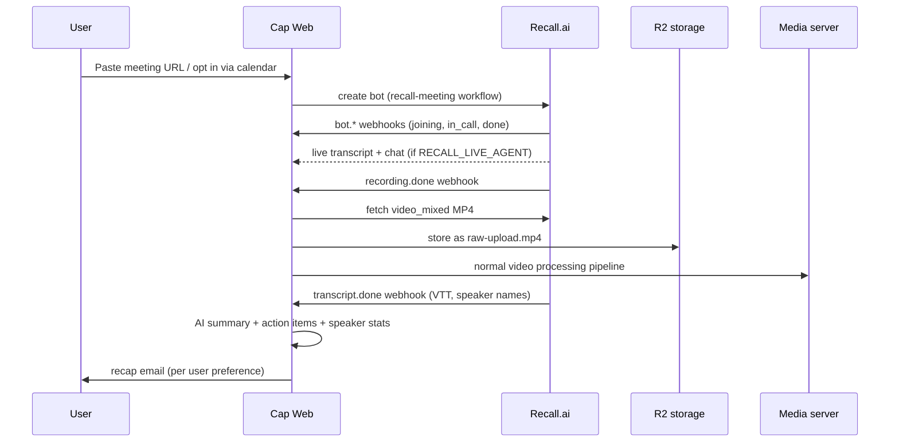

# Architecture

This describes the meeting recording layer this fork adds on top of
upstream Cap, and how the pieces fit together in a production deployment.
For general Cap concepts (Instant/Studio recording, the editor, sharing),
see upstream's docs at [cap.so/docs](https://cap.so/docs).

## Services

- **Cap Web** — the Next.js app (`apps/web`), port 3000 (pinned; see
  `CLAUDE.md` for a worked example's deployment specifics). Serves the
  dashboard, API routes, webhooks, and the effect-based HTTP API.
- **Media server** — `capsoftware/cap-media-server`, port 3456. Muxes and
  processes uploaded video, including recordings copied in from Recall.
- **MySQL** — primary database, schema managed by Drizzle
  (`packages/database`).
- **cron** — hits the recovery and reconciliation endpoints
  (`/api/cron/recover-failed-video-processing`,
  `/api/cron/finalize-stale-desktop-segments`,
  `/api/cron/recall-reconcile`) every few minutes.
- **db-backup** — a scheduled database backup job.
- **Object storage** — video storage, private bucket, signed URLs
  (S3-compatible; e.g. Cloudflare R2).
- **Email provider** — transactional email (recap emails, invites), e.g.
  Resend or Postmark's HTTP API.
- **LLM provider** — AI summaries, action items, and in-call assistant
  answers (OpenAI, Anthropic, Groq, or an OpenAI-compatible endpoint).
- **AssemblyAI** — Cap's own transcription fallback, and (optionally)
  Recall's transcription provider when `RECALL_TRANSCRIPTION_PROVIDER=assemblyai`.
- **Recall.ai** — runs the meeting bots: joins calls, records, transcribes,
  streams live chat/transcript, and syncs calendars. All in one region,
  set via `RECALL_REGION`.

## Meeting data flow



Bot creation and calendar sync run through `workflow`-based durable
workflows so retries survive process restarts:

- `apps/web/workflows/recall-meeting.ts` — creates the bot, and after
  `recording.done`/`transcript.done`, imports the video into Cap, kicks off
  processing, computes speaker stats, imports chat/notes as timeline
  comments, and applies the recap/visibility rules.
- `apps/web/workflows/recall-calendar-sync.ts` — keeps `meeting_calendars`
  and per-series record/skip rules in sync with `calendar.sync_events`.

If Recall's own transcription fails (`transcript.failed`), the video's
`transcriptionStatus` is reset and it's queued through Cap's normal
AssemblyAI pipeline instead — the meeting isn't left untranscribed.

Every inbound webhook is verified (`apps/web/lib/recall/verify.ts`) and
deduplicated by `webhook-id` against `recall_webhook_events` before
`apps/web/lib/recall/webhooks.ts` dispatches it.

## Database tables

Added in `packages/database/schema.ts`, alongside upstream's `videos`,
`video_uploads`, `video_processing_jobs`, `organizations`:

| Table | Purpose |
| --- | --- |
| `meeting_bots` | One row per meeting: source, URL, schedule, Recall bot/recording/transcript ids, status, and the resulting `videoId`. |
| `meeting_calendars` | A user's connected Recall calendar (Google), with the auto-record switch. |
| `meeting_preferences` | Per-user recap mode (`off` / `self` / `attendees`). |
| `meeting_vocabulary` | Org-level custom transcription vocabulary terms. |
| `meeting_calendar_series_rules` | Per-recurring-series record/skip decisions. |
| `recall_webhook_events` | Dedup log of processed webhook deliveries, keyed by `webhook-id`. |
| `slack_huddle_teams` | Slack workspaces that have invited the Huddles bot, and its activation status. |
| `video_shares` | Per-person access to a video: who it's shared with, who shared it, and how (owner, meeting attendee, or manually added). Drives meeting visibility and the share dialog's "People with access" list; replaced the earlier per-meeting Space approach. |

## Realtime endpoint

`/api/webhooks/recall/realtime` receives streamed transcript and chat
events for bots created with the live agent enabled, verified with the same
workspace secret as the main webhook. `apps/web/lib/recall/chat-agent.ts`
answers `/nt`-triggered chat messages using the live transcript as context,
optionally with OpenAI web search; `apps/web/lib/recall/live-transcript.ts`
persists the running transcript/chat that both the agent and the live
`/dashboard/meetings/<id>` view read from.

## Where things live

```
apps/web/lib/recall/            Recall API client, config, webhooks, transcript/vtt
                                 conversion, chat agent, recap email, visibility,
                                 speaker stats, vocabulary, calendar OAuth
apps/web/workflows/recall-*.ts  Durable workflows: bot lifecycle, calendar sync
apps/web/app/api/webhooks/recall/            Dashboard webhook + realtime endpoint
apps/web/app/api/integrations/recall-calendar/  Google Calendar V2 connect/callback
apps/web/app/api/cron/recall-reconcile/      Periodic reconciliation with Recall
apps/web/app/(org)/dashboard/meetings/       Meetings list + live/detail page
packages/database/schema.ts                  meeting_* and recall_* tables
packages/env/server.ts                       RECALL_* environment schema
```

## Monitoring

Sentry is opt-in: the server, edge, and browser SDKs only initialise when
`SENTRY_DSN` / `NEXT_PUBLIC_SENTRY_DSN` are set, so a deployment that
doesn't configure them runs with no Sentry SDK active at all. Where it's on,
`apps/web/lib/monitoring.ts` exposes a `captureError` helper that the Recall
webhook and reconcile routes call on failure, and `apps/web/app/global-error.tsx`
is a global error boundary that reports uncaught client crashes.

## Deployment specifics

See [`README.md`](README.md#deploy-your-own) for a general deployment
guide any organization can follow. `CLAUDE.md` documents one concrete
example deployment (Railway service ids, storage bucket, the exact webhook
event subscription, Slack Huddles one-time setup) as a worked reference,
not as the defaults this app assumes; this document only covers what the
code does.
